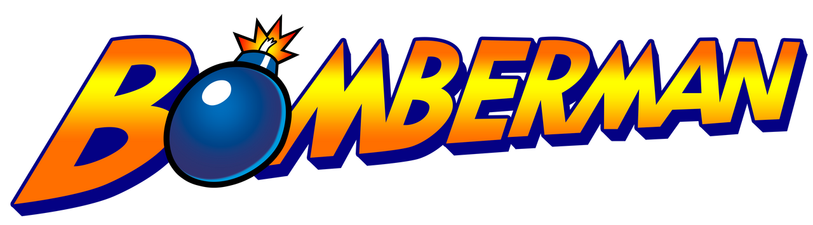

# BOMBERMAN

## Objetivo
Este proyecto tiene como objetivo ayudarnos a comprender de mejor manera el uso y aplicación de la programación orientada a objetos, en este caso se escogio el juego de Bomberman para intentar replicarlo o al menos acercarse al juego original para asi desarrollar de mejor manera nuestras capacidades.

### Hecho por:

Rodrigo Hernández Zavala 
22310215 
3°F
